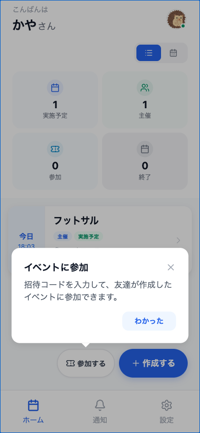
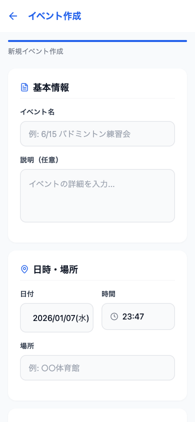
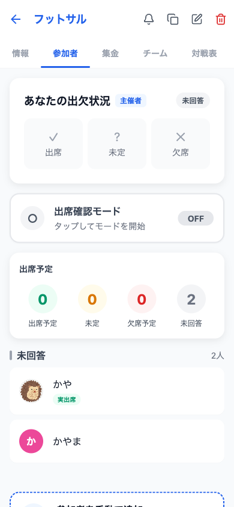
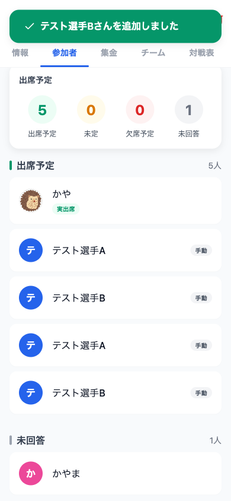
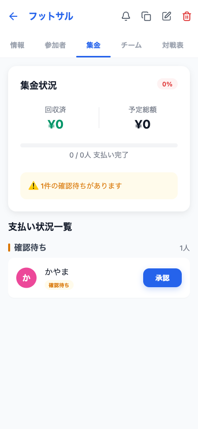
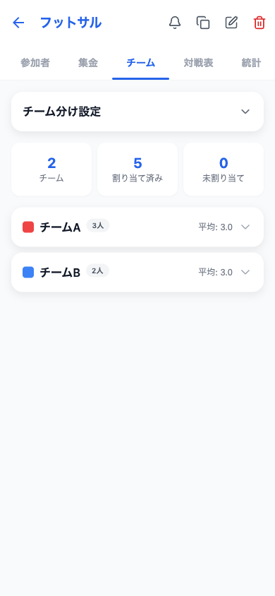

# ATSUME アプリ紹介ストーリー

> **ATSUME** - イベント管理をもっと簡単に

フットサルやスポーツイベントの主催者・参加者のための統合イベント管理アプリです。

---

## ストーリー概要

**田中さん**は毎週フットサルを主催しています。参加者管理、集金、チーム分け、試合の進行管理...いつも大変でした。そんな田中さんがATSUMEを使い始めてから、イベント運営が劇的に楽になりました。

---

## シーン1: アプリの入り口

### ログイン画面


**シンプルで直感的なデザイン**

- ブルーを基調としたクリーンなUI
- メールアドレスとパスワードで簡単ログイン
- 「アカウントを作成する」で新規登録も簡単

> 💡 ATSUMEは日本語に完全対応。直感的に使えます。

---

## シーン2: ホーム画面

### イベント一覧



**一目でわかるイベント管理**

- **実施予定**: これから開催するイベント数
- **主催**: 自分が主催者のイベント数
- **参加**: 参加予定のイベント数
- **終了**: 完了したイベント数

カレンダービューとリストビューを切り替えて、スケジュールを確認できます。

> 📅 「フットサル」イベントが今日18:03から予定されています！

---

## シーン3: イベント作成

### 新規イベント作成画面



**簡単3ステップでイベント作成**

1. **基本情報**: イベント名と説明を入力
2. **日時・場所**: 開催日時と会場を設定
3. **参加設定**: 参加費、定員、スキルレベルを設定

作成後は自動で**招待コード**が生成され、LINEやメールで簡単に共有できます。

---

## シーン4: 参加者管理

### 参加受付タブ



**出欠管理を簡単に**

- **出席予定**: 参加が確定した人数
- **未定**: まだ回答していない人数
- **欠席予定**: 欠席が確定した人数
- **未確認**: 招待後、まだ回答がない人数

**出席確認モード**で、当日のチェックインも簡単に行えます。

---

## シーン5: 参加者追加

### 手動で参加者を追加



**アプリ未登録ユーザーも追加可能**

- 主催者が手動で参加者を追加
- 名前、スキルレベル、性別を設定
- 「手動」バッジで追加方法がわかる

> 👥 5人の参加予定者が登録されています

---

## シーン6: 集金管理

### 集金タブ



**お金の管理もスマートに**

- **回収済**: 受け取った金額
- **予定総額**: 全員から集める予定の金額
- **支払い完了**: 何人が支払ったか

**確認待ち**の通知で、支払い報告があった参加者を即座に把握。ワンタップで「承認」できます。

---

## シーン7: チーム分け

### チームタブ


**公平なチーム分けを自動で**

- **チーム数**: 2〜10チームから選択
- **ランダム分け**: Fisher-Yatesアルゴリズムで完全ランダム
- **スキル均等分け**: 蛇行ドラフト方式でバランスよく

参加予定者またはチェックイン済み参加者を対象に選べます。

---

## シーン8: チーム結果

### チーム分け完了



**見やすいチーム表示**

- チームカラーで視覚的に区別
- 各チームの人数と平均スキルレベルを表示
- メンバーの移動も簡単

> 🔴 チームA (3人) vs 🔵 チームB (2人)

---

## シーン9: 対戦表作成

### 対戦表タブ


**多彩な対戦形式に対応**

- **総当たり戦**: 全チームが対戦
- **シングルエリミネーション**: トーナメント形式
- **ダブルエリミネーション**: 敗者復活戦あり
- **スイスドロー**: 同じ勝敗数同士で対戦
- **グループステージ**: 予選リーグ+決勝

団体戦・個人戦どちらも対応！

---

## シーン10: レスポンシブデザイン

### タブレット対応


### デスクトップ対応


**どのデバイスでも快適に**

- スマートフォン (iOS / Android)
- タブレット (iPad)
- デスクトップ (Webブラウザ)

---

## 主な機能一覧

| 機能 | 説明 |
|------|------|
| 🎫 **イベント作成** | 名前、日時、場所、参加費、定員を設定 |
| 👥 **参加者管理** | 出欠確認、チェックイン管理 |
| 💰 **集金管理** | 支払い状況の確認と承認 |
| 🏃 **チーム分け** | ランダム・スキル均等分け |
| 🏆 **対戦表** | 5種類の対戦形式に対応 |
| ⏱️ **タイマー** | 試合時間の計測と通知 |
| 🔗 **招待リンク** | コード共有で簡単招待 |
| 📱 **レスポンシブ** | スマホ、タブレット、PC対応 |

---

## ターゲットユーザー

### 主催者として

- フットサル、バスケ、バレーなどのスポーツイベント主催者
- 社内イベント、サークル活動の幹事
- 地域のスポーツ大会運営者

### 参加者として

- イベントに気軽に参加したい人
- 出欠連絡や支払いを簡単に済ませたい人
- チーム分けや対戦表を確認したい人

---

## 技術スタック

- **フロントエンド**: React Native (Expo)
- **バックエンド**: Supabase (PostgreSQL)
- **状態管理**: Zustand
- **言語**: TypeScript

---

## スクリーンショット一覧

### 認証フロー
- `01_initial_screen.png` - ログイン画面
- `uc_a1_signup_screen.png` - サインアップ画面
- `uc_a3_forgot_password.png` - パスワードリセット

### ホーム・イベント
- `UC-1.2_login_success.png` - ホーム画面
- `UC-2.1_event_create.png` - イベント作成
- `UC-2.6_invite_code.png` - 招待コード

### 参加者・集金
- `UC-4.1_participants.png` - 参加者管理
- `tournament_01_participants_added.png` - 参加者追加
- `UC-5.1_payment.png` - 集金管理

### チーム・対戦
- `UC-6.1_teams.png` - チーム分け設定
- `tournament_03_teams_created.png` - チーム分け結果
- `UC-7.1_matches.png` - 対戦表設定
- `tournament_05_matches_generated.png` - 対戦表生成

### レスポンシブ
- `responsive_tablet.png` - タブレット表示
- `responsive_desktop.png` - デスクトップ表示
- `responsive_small_mobile.png` - 小型スマホ表示

---

## Playwrightテストスクリプト

スクリーンショットの自動撮影は以下のスクリプトで実行できます:

```bash
# 開発サーバーを起動
npm start

# 別ターミナルでE2Eテストを実行
node e2e/e2e-app-story.mjs
```

---

*ATSUMEで、イベント管理をもっと簡単に。*
